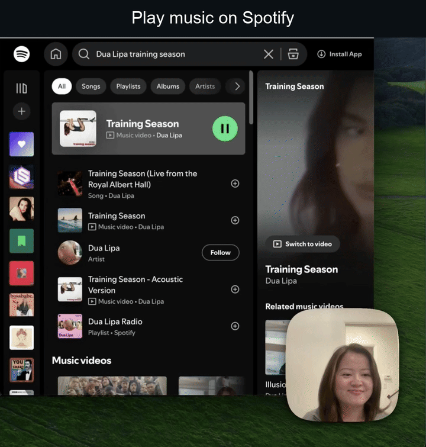

# Cursor Chrome Browser

**Give your Cursor agent a real browser. Your Chrome, your profile, your logins.**

Cursor's agent is great inside the IDE, but the work doesn't stop at code. This connects Composer to
your actual Chrome, the one with your profile and your sessions already signed in. Ask it to pull
your Spotify playlists, place a DoorDash order, or read your X feed, and it just works. No re-login,
no OAuth dance, no auth errors. It's the browser you're already using, driven by the agent.

A Chrome extension plus a small MCP server, talking over a single WebSocket. Billed to your Cursor
subscription, no extra model API key.

## See it drive

One session, three real sites, all signed in. Composer plays music on Spotify, replies to a
researcher on X, and orders Molly Tea on DoorDash. No re-auth, no captcha wall.



Full clip: [demo video on X](https://x.com/lily_gpupoor/status/2066788176564490712).

## Install

### 1. Server

```bash
cd server
npm install
```

### 2. Extension

1. Open `chrome://extensions`, enable **Developer mode**.
2. **Load unpacked** → select the `extension/` directory.

(Chrome Web Store distribution is planned; for now it's an unpacked dev load.)

### 3. Point Cursor at the server

Add to `~/.cursor/mcp.json` (use the **absolute** path to this repo):

```json
{
  "mcpServers": {
    "cursor-chrome-browser": {
      "command": "node",
      "args": ["/ABSOLUTE/PATH/TO/cursor-chrome-browser/server/mcp-server.js"]
    }
  }
}
```

Restart Cursor; `cursor-chrome-browser` should show up under Settings → MCP.

### 4. Drive it

In Composer, ask it to do something on a site you're logged into (e.g. *"open my Linear and
summarize my latest 3 tickets"*). On first use you pick which tab to hand over; from there Composer
operates your real, logged-in browser. Automation runs in a blue **MCP** tab group and **brings
that Chrome window to the front** on every tool call so you can watch it work.

## How it works

Two components, one product:

```
Cursor (Composer)  ⇄ stdio MCP ⇄  server/  ⇄ WebSocket ⇄  extension/  ⇄ CDP ⇄  your Chrome
```

- **`extension/`** is a Manifest V3 Chrome extension that drives tabs via the Chrome DevTools
  Protocol (click, type, screenshot, scroll, read the accessibility tree, run JS, read
  console/network). It connects to the server as a WebSocket client.
- **`server/`** is an MCP server Cursor launches via `~/.cursor/mcp.json`. It exposes 18 browser
  tools to Composer and runs a localhost WebSocket server the extension connects to.

No native-messaging host, no `install.sh`, no extension-ID juggling, just two hops instead of three.

## The 18 tools

Tab/context: `tabs_context_mcp`, `tabs_create_mcp`, `switch_browser`. Navigation: `navigate`.
Interaction: `computer` (click/type/screenshot/scroll/key/drag/hover/zoom), `find`, `form_input`,
`upload_image`. Reading: `read_page`, `get_page_text`, `read_console_messages`,
`read_network_requests`. Utility: `javascript_tool`, `gif_creator`, `resize_window`,
`shortcuts_list`, `shortcuts_execute`, `update_plan`.

## Verify the server

```bash
cd server && npm run smoke
```

Launches the MCP server over stdio (as Cursor would) and confirms all 18 tools are exposed. No
browser needed.

## Credits

The CDP tool implementations (the `computer`/`read_page`/`find` logic and tool schemas) are
borrowed from [`noemica-io/open-claude-in-chrome`](https://github.com/noemica-io/open-claude-in-chrome)
(MIT), a clean-room clone of Claude-in-Chrome's 18 tools. We redesigned the transport (native
messaging + TCP → a single WebSocket), retargeted it from Claude Code to Cursor, and packaged it as
one product.
